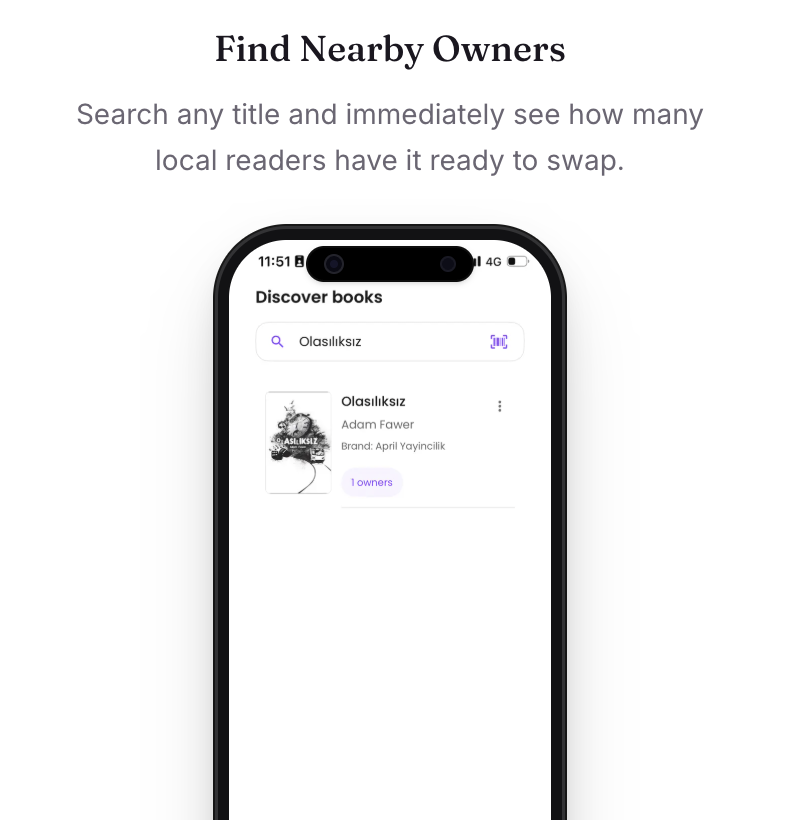

  

<h1 align="center">BookSwap</h1>

  <strong>The mobile app for exchanging books with real people.</strong> 
  Discover, match, and swap books through a shared catalog of over <strong>28+ million titles</strong>.

  Browse what others own, offer books from your own shelf, and manage every step of the exchange from matching to completed swaps in one place.

  
  
  

## Features

- Search across a catalog of **28M+ books**
- Build and manage your personal library
- Send and receive swap offers
- Track swap offers from request to completion
- View completed swap history
- Receive push notifications for offers and updates
- Secure authentication
- Optimized image loading and caching
- Network-aware error handling and request retries
- Multi-language support

## Screenshots

<table>
  <tr>
    <td></td>
    <td></td>
  </tr>
  <tr>
    <td></td>
    <td></td>
  </tr>
</table>

## Tech Stack

| Layer | Technologies |
|-------|-------------|
| Mobile | React Native, Expo |
| Language | TypeScript |
| Navigation | React Navigation |
| Backend | Python, Flask |
| Database | PostgreSQL |
| Notifications | Expo Push Notifications |
| Authentication | JWT |

## Engineering Highlights

BookSwap is a full-featured mobile application built around a complete book exchange workflow.

- Designed and implemented the end-to-end swap workflow
- Integrated search across a **28M+ book catalog**
- Built authenticated API communication and protected application flows
- Implemented image caching to improve mobile performance
- Added network-aware request handling with retries and timeouts
- Integrated Expo push notifications for swap activity
- Implemented internationalization
- Optimized list rendering and image-heavy screens for mobile devices

## Status

BookSwap has been submitted to the Apple App Store and is currently under review.

© 2026 Zeynep Dündar. All rights reserved.